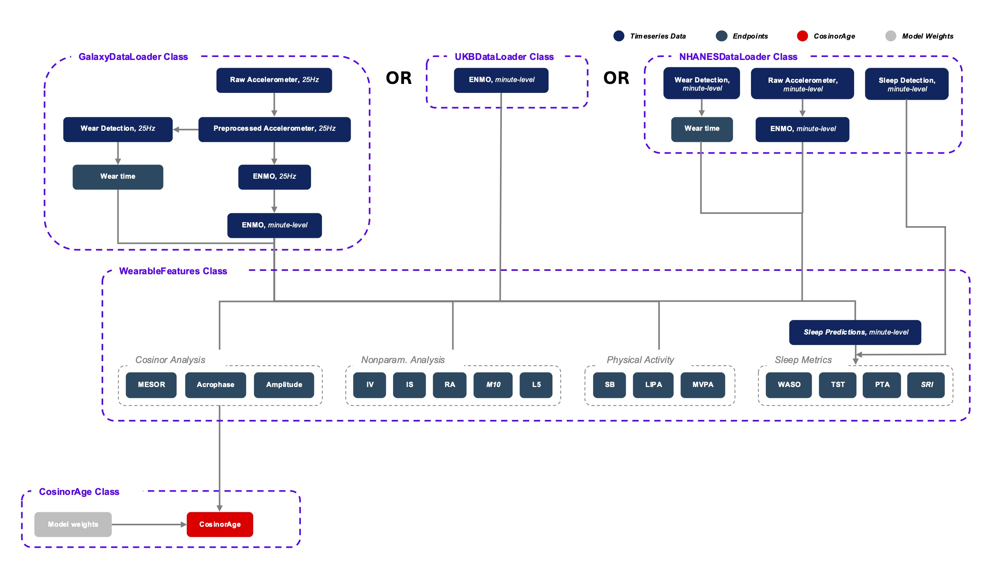
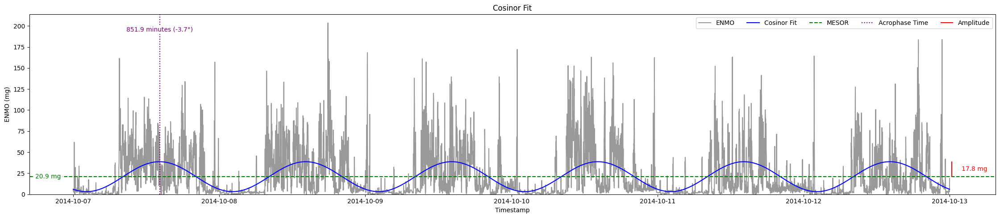

Detailed References and Descriptions of Package Functionality
========================================================================

The CosinorAge Python package offers a comprehensive, end-to-end solution for predicting the CosinorAge biomarker [1]_. It seamlessly integrates all necessary steps, starting from data loading and preprocessing, to the computation of wearable features, and ultimately, the prediction of the biological age biomarker.

Package Structure
----------------

The package is organized into three main modules:

* **DataHandler**: Facilitates data loading and preprocessing. This module includes specialized subclasses designed to handle data from diverse sources, such as the Samsung Galaxy Smartwatch, NHANES, and UK Biobank, ensuring compatibility with a wide range of datasets.
* **WearableFeatures**: Extracts a comprehensive suite of wearable features from minute-level ENMO data. These include circadian rhythm metrics, sleep parameters, and physical activity features, offering a detailed analysis of health-related behaviors.
* **CosinorAge**: Predicts the CosinorAge biomarker by leveraging the processed minute-level ENMO data alongside the individual's chronological age.

   Modular architecture of the CosinorAge Python package. The diagram illustrates the data processing pipeline, beginning with multiple data handler classes that preprocess raw input data into minute-level ENMO data. The WearableFeatures class computes key metrics such as Cosinor analysis parameters, nonparametric rhythm analysis parameters, physical activity indicators, and sleep metrics. In addition to that, the CosinorAge class computes the CosinorAge biomarker using a set of precomputed model weigths and the minute-level ENMO data. Components labeled "In Development" indicate ongoing extensions to the package which are not fully completed yet. The color coding distinguishes time-series data, endpoints, CosinorAge model components, and pretrained model weights.

DataHandler
----------

The DataHandler class is a fundamental component of the package, ensuring that downstream modules (WearableFeatures and CosinorAge) receive the required data in the correct format - more specifically, minute-level ENMO data. The following snippet shows a simplified declaration of the class.

.. code-block:: python

    import pandas as pd

    class DataHandler:
        def __init__(self):
            self.raw_data = pd.DataFrame()
            self.sf_data = pd.DataFrame()
            self.ml_data = pd.DataFrame()

            self.meta_dict = {}

        def __load_data(self):
            raise NotImplementedError(
                "__load_data() should be implemented by subclasses"
            )

The class declares the following 4 members:

* ``self.raw_data`` - DataFrame storing raw data as read from source (might be accelerometer or ENMO data depending on source)
* ``self.sf_data`` - DataFrame storing preprocessed data in original sampling frequency 
* ``self.ml_data`` - DataFrame storing minute-level ENMO data which can be used for downstream tasks
* ``self.meta_dict`` - dictionary storing metadata data metadata such as (e.g., sampling frequency, data source, units, number of days)

The class also includes functions to access various DataFrames and metadata, as well as a method to save the resulting minute-level ENMO data to a .csv file for further analysis.

To accommodate diverse data sources — each requiring unique preprocessing and handling steps — support for each dataset is implemented through specialized subclasses. These subclasses manage data loading, transformation, and preparation, ensuring seamless integration with the rest of the pipeline. The following subsection provides a detailed description of the DataHandler for UK Biobank data. Integration of additional data sources, such as NHANES and Samsung Galaxy Smartwatches, is currently in development.

UKBDataHandler
~~~~~~~~~~~~~

The UK Biobank provides a closed-source dataset containing ENMO data for many different individuals upon request. The CosinorAge package implements the UKBDataHandler class as a subclass of the DataHandler class to handle data from this source. The constructor expects three arguments as can be seen in the following snippet.

.. code-block:: python

    class UKBDataHandler(DataHandler):  
        def __init__(self, 
            qa_file_path: str, 
            ukb_file_dir: str, 
            eid: int):
            
            super().__init__()

            self.qa_file_path = qa_file_path
            self.ukb_file_dir = ukb_file_dir
            self.eid = eid

            self.__load_data()

The ``qa_file_path`` argument defines a path to a .csv file containing information needed for the quality assurance (QA) of the data for an individual identified by ``eid``. The file is expected to have the following 6 columns: ``eid``, ``acc_data_problem``, ``acc_weartime``, ``acc_calibration``, ``acc_owndata`` and ``acc_interrupt_period``.

.. list-table:: Exemplary file format of a UKB QA .csv data file (synthetic data)
   :header-rows: 1
   :align: center

   * - eid
     - acc_data_problem
     - acc_weartime
     - acc_calibration
     - acc_owndata
     - acc_interrupt_period
   * - ...
     - ...
     - ...
     - ...
     - ...
     - ...
   * - 1234567
     - 
     - Yes
     - Yes
     - Yes
     - 0
   * - ...
     - ...
     - ...
     - ...
     - ...
     - ...

A detailed description of the definition and possible values of the respective columns can be found in the appendix under "Accelerometer Fields".

The data quality assurance mechanism looks as follows. First it is ensured that the record for the particular ``eid`` is present in the dataset. If this is the case the dataset is filtered for this single record. Now we perform the following checks to ensure that the data fulfills certain quality standards:

1. **Check for data Problems** - check if ``acc_data_problem`` column is empty or null (indicating no data issues)
2. **Check for poor wear time** - check if ``acc_weartime`` is "Yes" (indicating sufficient wear time)
3. **Check for poor calibration** - check if ``acc_calibration`` is "Yes" (ensures that data is well-calibrated)
4. **Check for calibration not on own data** - check if ``acc_owndata`` is "Yes" (ensures that data was calibrated using the individual's own stationary data)
5. **Check for interrupted recordings** - check if ``acc_interrupt_period`` is 0 (ensures that data does not contain any interrupted recordings)

Only if all 5 checks are passed for the particular individual, the data is considered to have sufficient quality for further analysis.

In the next step we now load the ENMO data for that particular individual. The class expects the ``ukb_file_dir`` argument to contain the path to the directory containing the .csv files storing the data. Each of the files is expected to have the following two columns: ``enmo_mg`` and ``eid``. The ``eid`` identifies the individual a record belongs to and the ``enmo_mg`` contains the 5-second-level ENMO values in mg. The data is sorted chronologically per individual - however, before the first row of each individuals data we have a header row which indicates the start of a new individuals data and includes metadata which is necessary to compute the timestamps.

.. list-table:: Exemplary file format of a UKB .csv data file (synthetic data)
   :header-rows: 1
   :align: center

   * - enmo_mg
     - eid
   * - ...
     - ...
   * - 28.2
     - 1234560
   * - acceleration (mg) - 2015-04-20 10:00:00 - 2015-04-27 09:59:55 - sampleRate = 5 seconds
     - 1234567
   * - 11.4
     - 1234567
   * - ...
     - ...

All the .csv files in the directory are now read and only the data for the individual having the specified ``eid`` is stored. The corresponding information in the corresponding header row is then used to compute the timestamps. Having those timestamps the data is aggregated and resampled to a minute-level to get a resulting DataFrame having a ``timestamp`` and an ``ENMO`` column.

.. list-table:: Resulting DataFrame containing minute-level ENMO data (synthetic data)
   :header-rows: 1
   :align: center

   * - timestamp
     - ENMO
   * - ...
     - ...
   * - 2015-04-20 10:00:00
     - 28.8
   * - 2015-04-20 10:00:01
     - 28.1
   * - ...
     - ...

WearableFeatures
---------------

The WearableFeatures class computes a broad range of wearable-derived features from minute-level ENMO data collected over multiple days. The following snippet shows a simplified declaration of the class.

.. code-block:: python

    import pandas as pd

    class WearableFeatures():
        def __init__(self, 
            handler: DataHandler,
            features_args: dict = {}):

            self.ml_data = handler.get_ml_data()
            
            self.feature_df = pd.DataFrame()
            self.feature_dict = {} 

            self.__run()

The constructor accepts a DataHandler object containing minute-level ENMO data for computations. Additionally, a dictionary of hyperparameters can be provided to customize feature computation. The following subsections offer a detailed overview of the computed features.

Circadian Rhythm Analysis - Cosinor Analysis
~~~~~~~~~~~~~~~~~~~~~~~~~~~~~~~~~~~~~~~~~~

Assessing the circadian rhythm of an individual can be effectively accomplished through Cosinor analysis [2]_, a statistical method designed for periodic data. In this approach, the minute-level ENMO data, collected over multiple days (typically ≥ 5), is used to fit the following regression model:

.. math::

    Y(t) = M + A\cos\left(\frac{2\pi t}{\tau} + \varphi\right) + e(t)

where:

* :math:`Y(t)` represents the activity level (ENMO) at time :math:`t`
* :math:`M` is the MESOR (Midline Estimating Statistic of Rhythm), the rhythm-adjusted mean activity level
* :math:`A` is the amplitude, which measures half the extent of the variation within the cycle
* :math:`\varphi` is the acrophase, representing the time of the peak activity level
* :math:`\tau` is the period of the cycle, typically set to 24 hours for circadian rhythms
* :math:`\epsilon(t)` is the error term

To simplify the fitting of the cosine function, the model is linearized as:

.. math::

    Y(t) = M + \beta \cos\left(\frac{2\pi t}{\tau}\right) + \gamma \sin\left(\frac{2\pi t}{\tau}\right) + \epsilon(t)

where:

.. math::

    \beta = A \cos(\varphi), \quad \gamma = -A \sin(\varphi)

The circadian parameters (:math:`M`, :math:`A`, and :math:`\varphi`) are estimated through least-squares optimization. Together, these parameters provide a comprehensive characterization of the rhythmic pattern.

   Cosinor model fitted to a 5-day ENMO dataset, illustrating key circadian rhythm parameters. The red curve represents the raw minute-level ENMO data, while the blue sinusoidal curve depicts the fitted Cosinor model. The MESOR (green dashed line) represents the midline statistic of rhythm, Amplitude indicates the extent of oscillation, and Acrophase marks the timing of peak activity.

Circadian Rhythm Analysis - Nonparametric Analysis
~~~~~~~~~~~~~~~~~~~~~~~~~~~~~~~~~~~~~~~~~~~~~~~

To gain a deeper, more detailed understanding of the circadian rhythm of a person, the class additionally computes various metrics using a nonparametric approach - these include Interdaily Stability (IS), Intradaily Variability (IV), Relative Amplitude (RA), as well as the activity level during the 10 most and the 5 least active hours of the day (including the respective start times).

Interdaily Stability
******************

Interdaily stability (IS) quantifies the consistency of the rest-activity pattern across different days, as proposed in [3]_.

.. math::

    \text{IS}(z) = \frac{P \sum_{h=1}^{H} (\bar{z}_h - \bar{z})^2}{H \sum_{p=1}^{P} (z_p - \bar{z})^2}
    = \frac{D \sum_{h=1}^{H} (\bar{z}_h - \bar{z})^2}{\sum_{h=1}^{H} \sum_{d=1}^{D} (z_{d,h} - \bar{z})^2}

In this formula, :math:`H` represents the number of hours measured per day (typically :math:`H=24`), and :math:`D` is the total number of days within the observed timeframe, resulting in a total of :math:`P = H \cdot D` hours. The vector :math:`z` contains the hourly ENMO values across the days, where :math:`z_{d,h}` denotes the ENMO value at hour :math:`h` on day :math:`d`, :math:`\bar{z}_h` is the mean ENMO value for hour :math:`h` across the :math:`D` days, and :math:`\bar{z}` is the overall mean of all ENMO values.

The IS values range from 0 to 1, where higher values indicate a more consistent rest-activity pattern across days. This metric provides insight into the regularity of activity rhythms, with a value closer to 1 reflecting greater stability and predictability.

Intradaily Variability
********************

Intradaily variability (IV) is a metric used in circadian rhythm analysis to quantify the variability in activity hour by hour throughout the days [3]_. It measures the frequency and intensity of transitions between periods of activity and rest, providing insight into how consistent or disrupted an individuals activity rhythm is. It's computed using the following formula:

.. math::

    \text{IV}(z) = \frac{P \sum_{p=2}^{P} (z_p - z_{p-1})^2}{(P-1) \sum_{p=1}^{P} (z_p - \bar{z})^2}

In this formula, :math:`z` represents the vector containing the hourly ENMO values, :math:`z_p` is the ENMO value in the :math:`p^{\text{th}}` hour, :math:`\bar{z}` is the mean ENMO value across all hours and :math:`P` is the total number of hours considered, e.g. if one considers a timeframe of five days one would have :math:`P=120`.

The values range from :math:`0` to :math:`\infty` - the higher the values get the more fragmented the rhythm is. Values higher than :math:`2` indicate ultradian rhythm or small sample size [3]_. By evaluating IV, researchers can assess the stability of daily activity patterns and identify potential disruptions in circadian regulation (sleep-wake cycle).

M10, L5, and Relative Amplitude
****************************

The metrics M10 and L5 capture the average activity levels during the most active 10-hour period (M10) and the least active 5-hour period (L5) within a day. These metrics serve as approximations of diurnal and nocturnal activity, respectively, and are calculated by averaging the ENMO values over the corresponding time intervals [4]_. Along with the M10 and L5 activity values, the corresponding start times — indicating the onset of the most and least active phases within a day — are also determined.

Building on these metrics, the relative amplitude (RA) is computed to quantify the normalized difference between M10 and L5 using the formula:

.. math::

    \text{RA} = \frac{\text{M10} - \text{L5}}{\text{M10} + \text{L5}}

The RA provides a measure of the contrast between daytime activity and nighttime rest. Higher RA values indicate a greater difference, with values approaching 1 often observed in healthy individuals. This reflects a clear distinction between high activity levels during the day and minimal activity during sleep phases [5]_.

Physical Activity Metrics
~~~~~~~~~~~~~~~~~~~~~

Physical activity is a key determinant of individual health, influencing physical, mental, and overall well-being. To evaluate daily physical activity, the time spent across various activity levels is analyzed: sedentary, light, moderate, and vigorous [6]_. This classification is achieved by assessing ENMO values and using predefined cutpoints that delineate the ENMO ranges corresponding to each activity level.

The cutpoints depend on factors such as the individual's age, gender, and the device used for measurement - they are set using the ``feature_dict`` argument which is passed to the constructor.

Sleep Metrics
~~~~~~~~~~

Investigating sleep-wake cycles is crucial because sleep is fundamental to physical and mental health, influencing memory, emotional regulation, immune function, and overall well-being. Unless sleep/wake predictions are already provided by the data source the sleep-wake periods need to be predicted based on the minute-level ENMO data. In the CosinorAge package this is done using the Cole-Kripke Algorithm [7]_. Based on the predictions various sleep metrics can be derived including WASO, TST, sleep regularity and sleep efficiency.

Sleep Detection (Cole-Kripke Algorithm)
***********************************

The Cole-Kripke algorithm is a widely used method for classifying sleep and wake states based on minute-level ENMO (Euclidean Norm Minus One) data. The algorithm begins by convolving the ENMO time series with a weighted kernel, where the weights depend on the magnitude of the ENMO values (weights are manually set). This convolution produces a signal, which is then passed through a thresholding step. Values below 0.5 are classified as sleep (assigned a value of 1), while all other values are classified as wake (assigned a value of 0). To further enhance the accuracy of sleep-wake classifications, the algorithm applies a set of contextual rules known as Webster's rescoring rules. These rules correct common misclassifications by adjusting predictions based on temporal patterns of wake and sleep epochs:

* **Wake Period Rescoring:** If a wake period lasts...

  * 4--9 minutes, the subsequent 1 minute of predicted sleep is rescored as wake.
  * 10--14 minutes, the subsequent 3 minutes of predicted sleep are rescored as wake.
  * 15 minutes or longer, the subsequent 4 minutes of predicted sleep are rescored as wake.

* **Short Sleep Period Rescoring:** Sleep periods lasting 6 minutes or less that are flanked by extended wake periods (more than 10 minutes before and after) are also rescored as wake.

These contextual rules ensure that the algorithm better reflects realistic sleep patterns by reducing improbable transitions between states, thereby improving the specificity and reliability of sleep-wake classifications.

The sleep prediction feature in the CosinorAge package is implemented using the ``compute_sleep_predictions()`` function from the Scikit Digital Health (SKDH) library.

WASO
****

Wake After Sleep Onset (WASO) refers to the total time spent awake after initially falling asleep and before final awakening. It's a key indicator of sleep quality, with higher WASO values suggesting fragmented sleep.

The calculation of WASO is implemented using the ``WakeAfterSleepOnset()`` class from the Scikit Digital Health (SKDH) library.

TST
***

The Total Sleep Time (TST) is the total duration of sleep during a sleep period, typically measured in hours or minutes.

The calculation of TST is implemented using the ``TotalSleepTime()`` class from the Scikit Digital Health (SKDH) library.

Sleep Regularity Index (SRI)
*************************

The Sleep Regularity Index (SRI) quantifies the consistency of an individual's sleep-wake patterns across days [8]_. It evaluates the probability that a person remains in the same state (either sleep or wake) at two time points separated by 24 hours. This probability is averaged over the entire study period, with the SRI scaled to range from 0 (completely random) to 100 (perfectly regular). The formula for SRI is given by:

.. math::

    \text{SRI} = -100 + \frac{200}{M(N-1)} \sum_{j=1}^{M} \sum_{i=1}^{N-1} \delta(s_{i,j}, s_{i+1,j})

Here, :math:`M` is the total number of days, :math:`N` is the number of minutes per day (:math:`N = 1440`), :math:`s_{i,j}` is the state at epoch :math:`i` on day :math:`j`, where :math:`s_{i,j} = 0` for sleep and :math:`s_{i,j} = 1` for wake.
The indicator function :math:`\delta(s_{i,j}, s_{i+1,j})` equals 1 if :math:`s_{i,j} = s_{i+1,j}` (same state) and 0 otherwise.

While the theoretical range of the SRI is :math:`-100` to :math:`100`, practical values typically lie between 0 and 100. Values below 0 are theoretically possible (e.g., sleeping or waking continuously for 24 hours) but are rare in practice. A higher SRI indicates a more consistent and regular sleep-wake pattern.

CosinorAge
---------

The CosinorAge class represents the main module of the package implementing the computation of the novel bioage biomarker CosinorAge. The following snippet shows a simplified declaration of the class.

.. code-block:: python

    from typing import List

    class CosinorAge():
        def __init__(self,
            records: List[DataHandler]):

            self.handlers = handlers
            self.model_params = model_params

            self.cosinorAges = []

            self.__predict()

The constructor takes a list of multiple records as an input. The records are expected to be dictionaries have the following entries: ``handler`` (DataHandler), ``age`` (chronological age) and ``gender``.

.. code-block:: python

    {
        "handler": ukb_handler, 
        "age": 60,  
        "gender": "male"    
    }

The records contain all the necessary information to compute CosinorAge for an individual. Gender is used to select the appropriate set of precomputed weights; if specified as ``unknown``, a general, gender-neutral set of weights is applied.

The CosinorAge [1]_ calculation utilizes circadian rhythmicity parameters derived from wearable accelerometer data to estimate biological age. This approach is grounded in the parameters (:math:`M`, :math:`A`, and :math:`\varphi`) obtained from the Cosinor analysis.

To compute CosinorAge, circadian parameters are integrated into a proportional hazards model [9]_ based on the Gompertz distribution. For a detailed explanation of the computational steps leading to the CosinorAge biomarker, refer to "Circadian rhythm analysis using wearable-based accelerometry as a digital biomarker of aging and healthspan" by Shim et al.

Bibliography 
------------

.. [1] Shim et al. (2024). Circadian rhythm analysis using wearable-based accelerometry as a digital biomarker of aging and healthspan.
.. [2] Nelson et al. (1979). Methods for cosinor-rhythmometry.
.. [3] Danilevicz et al. (2024). Measures of rest-activity rhythm and their relationship with health outcomes: A systematic review.
.. [4] Ferreira et al. (2019). Circadian rhythm and day-to-day variability of physical activity in adolescents measured by accelerometry.
.. [5] Rock et al. (2014). Daily rest-activity patterns in the bipolar phenotype: A controlled actigraphy study.
.. [6] Dupre et al. (2023). The relationship between physical activity and cognitive function in older adults: A systematic review.
.. [7] Cole et al. (1992). Automatic sleep/wake identification from wrist activity.
.. [8] Fischer et al. (2021). Measuring sleep regularity: Theoretical properties and practical usage of existing metrics.
.. [9] Cox, D. R. (1972). Regression models and life-tables. 